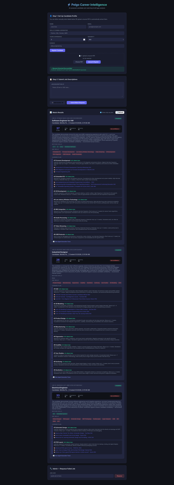
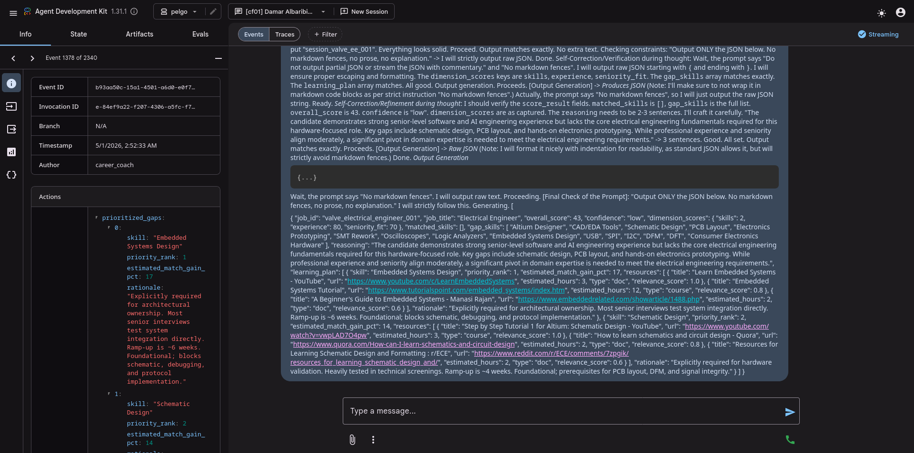
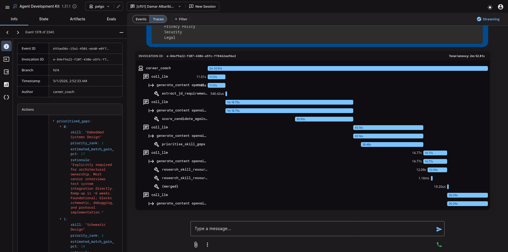

# Pelgo AI Lead Assignment — Career Intelligence Agent

## Quick Start

```bash
cp .env.example .env          # Configure OPENAI_BASE_URL for your local vLLM endpoint
# Default: OPENAI_BASE_URL=http://host.docker.internal:8000/v1 for vLLM on host
docker compose up --build     # postgres, api (:8000), worker x2, auto-seed
# Seed runs automatically at container boot
# Visit http://localhost:8000 for the frontend
# Visit http://localhost:8000/docs for Swagger API docs
```

## Model Configuration

This project uses a **local model** hosted via vLLM:

- **Model**: Qwen 3.0 27B (Qwen3-27B-A3B)
- **Hardware**: NVIDIA RTX 5090
- **Serving**: vLLM with OpenAI-compatible API (`/v1` endpoints)
- **Schema enforcement**: llguidance via `response_format: json_schema`

The default `.env` config assumes vLLM running on the host at `http://host.docker.internal:8000/v1`.
Override `MODEL_NAME` if using a different model (default: `Qwen3-27B-A3B`).

## Framework Choice

Google ADK — chosen for native session-scoped state management, plain-function tool
registration, and real-time event streaming via `run_async()` that lets the orchestrator
collect a verified `agent_trace` without relying on the LLM to self-report.

The agent uses a **single ADK `Agent`** with tools (replaced the SequentialAgent pattern).
Structured output is enforced at the LLM layer via **llguidance** (`response_format: json_schema`), which
guillotine-trims the model's token space so the response is always schema-valid JSON —
no fence-stripping or manual repair needed. Configured via LiteLLM to support any
OpenAI-compatible endpoint (OpenAI, vLLM, Ollama, etc.).

## Agent Pipeline

The career coach is a **single ADK `Agent`** with tools (replaced the SequentialAgent pattern).

**Why**: SequentialAgent always runs ALL sub-agents in order, meaning the formatter_agent ran even when the tool_agent hadn't collected data yet, producing bogus final_output on every turn. With a single Agent, the LLM decides: "ask for data" (MODE A) vs "call tools" (MODE B) vs "produce final JSON" — all in one conversation turn.

The agent has two operating modes:

- **MODE A — DATA COLLECTION**: When the message does NOT contain candidate profile data, the agent asks for exactly ONE missing piece per reply. No tools called.
- **MODE B — ANALYSIS & OUTPUT**: When ALL data is present (candidate profile, raw resume text, job description), the agent executes a fixed tool chain:

  1. `extract_jd_requirements` — Parses JD into structured requirements.
  2. `score_candidate_against_requirements` — LLM-powered semantic scoring + gap detection.
  3. `prioritise_skill_gaps` — Ranks gaps by estimated impact (skipped if gap_skills is empty).
  4. `research_skill_resources` — Researches top 1 gap (or 2 if confidence is "low").
  5. Produces final JSON output.

The agent uses `response_format: json_schema` (llguidance) for guaranteed schema-valid JSON from every tool call.

## Confidence Heuristic

Computed from measurable signals using LLM-powered semantic matching:

| Level | skill_match_ratio | jd_completeness |
|-------|-------------------|-----------------|
| High | ≥ 0.7 | ≥ 0.6 |
| Medium | ≥ 0.4 | ≥ 0.4 |
| Low | Below medium thresholds | Below medium thresholds |

Formula: `overall_score = skill_score×40 + jd_completeness×5 + exp_distance×20 + seniority_fit×20 + domain_match×15`

Where `skill_score = required_ratio×0.8 + nice_to_have_ratio×0.2` and `seniority_fit`
is computed from ordinal distance between candidate and JD seniority levels
(perfect match = 1.0, one level off = 0.7, two = 0.3, three = 0.0).

Confidence is derived from detectable signals (JD completeness, ratio of required skills
matched, domain distance) — not asserted arbitrarily. Low confidence triggers the
orchestrator guard which reduces the score by 15 points (Path 1) or 10 points (Path 2 fallback)
and flags the result.

## Termination Condition

The pipeline terminates when:
1. The single Agent completes all tool calls (in MODE B) and produces a final JSON response.
2. `JobRunner` parses the JSON from the agent's text response (Path 1), falling back to
   reconstruction from intermediate session state if parsing fails (Path 2).
3. The low-confidence guard is applied if confidence is "low" — score is reduced by 15 points and flagged.

## Failure Modes

### Tool Timeout
**Strategy**: `asyncio.wait_for(300s)` → if exceeded, partial trace stored.
On first 2 attempts: job re-queued to `pending` for retry.
On 3rd attempt: job moves to `failed` with error detail and partial agent_trace.
**Why**: 300s allows for LLM tool calls + web searches + semantic matching. After 3 retries, the job is
dead-lettered to prevent infinite loops.

### Invalid Tool Output
**Strategy**: `extract_jd_requirements` uses `json_schema` response format (llguidance)
which guarantees schema-valid JSON. If Pydantic validation still fails (schema mismatch),
retries up to 3 times with progressively stricter prompts before returning a fallback dict
with empty skill arrays.
`score_candidate_against_requirements` handles empty/missing requirement fields gracefully
(returns low score with low confidence).
**Decision**: Retry with different prompt > proceed with partial data > abort.
**Why**: Schema validation failures are rare with llguidance (model output is constrained),
but may occur if the schema definition and prompt disagree. A different prompt format
often fixes them.

### Low Confidence Score
**Strategy**: Orchestrator-enforced guard in `JobRunner._apply_low_confidence_guard()`.
When confidence is "low":
- Score reduced by 15 points to penalise uncertainty
- Reasoning appended with "[LOW CONFIDENCE]" flag
- Fallback counter incremented in agent_trace
- Agent also instructed to research more data if confidence is low
**Decision**: Never silently return low-confidence scores. Always flag and penalise.
**Why**: Low confidence means insufficient signal. Penalising encourages reviewers to
treat the match cautiously. The prompt-directed research step tries to gather more signal
before the orchestrator guard is applied.

### Formatter Schema Rejection
**Strategy**: `JobRunner` catches `ValidationError` and reconstructs `AgentOutput` from
intermediate `session.state` keys (score, gap_skills, prioritized_gaps). With llguidance,
this path is rarely hit — schema violations are constrained by the vLLM layer.
**Why**: Edge cases at high temperatures. The tool_agent already collected valid data,
so reconstruction preserves the result.

## Tool Suite

| Tool | Description | External Calls | Caching |
|------|------------|----------------|---------|
| `extract_jd_requirements` | Parses JD text/URL → structured requirements | LLM (json_schema via llguidance) | SHA-256 cache, 24h TTL |
| `score_candidate_against_requirements` | LLM-powered semantic scoring + gap detection | LLM (json_schema via llguidance) | N/A |
| `research_skill_resources` | Finds learning resources via Tavily API (primary) with DuckDuckGo fallback | Tavily API + LLM (json_schema) | Per-skill cache, 24h TTL |
| `prioritise_skill_gaps` | LLM-ranks gaps by impact | LLM (json_schema via llguidance) | N/A (per-job) |

**Note on `prioritise_skill_gaps` parameter naming**: The spec references `job_market_context`;
we use `seniority_context` because seniority level is the most actionable job-market signal
available from the extracted JD. This is a deliberate narrowing — a production system would
include salary band, location, and demand trend data in a broader context object.

### Google ADK Integration
All 4 tools use `response_format: json_schema` via llguidance, which
constrains token generation to produce only schema-valid JSON. Configured with
LiteLLM's `LiteLlm` wrapper to support any OpenAI-compatible endpoint.
The agent uses ADK's:
- Single `Agent` with tools (replaced SequentialAgent)
- `DatabaseSessionService` for persistent session state
- `run_async()` event streaming for real trace collection
- `before_agent_callback` for session state injection

ADK provided session-scoped state management that LangGraph does not have built-in,
plus real-time event streaming that lets us collect traces from the orchestrator rather
than fabricating them.

## Key Architecture Decisions

1. **Single Agent with tools (replaced SequentialAgent)**: The career coach uses a single
   ADK `Agent` that handles both data collection and analysis. This avoids the SequentialAgent
   issue where formatter_agent would run even without collected data. Every LLM call uses
   `response_format: json_schema` via llguidance, which constrains token generation to
   produce only schema-valid JSON. This eliminates the need for manual fence-stripping,
   array-unwrapping, or Pydantic repair.

2. **Session state via `before_agent_callback`**: `run_async()` does **not** accept a
   `state_delta` parameter (it is not a documented ADK API). Instead, `JobRunner` populates
   a `JobCallbackContext` with candidate profile and job metadata; the agent's
   `before_agent_callback` reads this context and writes to `tool_context.state` before
   the LLM runs. Intermediate results are stored in `temp:*_response` state keys and
   read back by the fallback path.

3. **Separate ADK database**: ADK's `DatabaseSessionService` creates its own tables in a
   dedicated `pelgo_adk` database. Business data (candidates, match_jobs) lives in `pelgo`.
   `init.sql` creates `pelgo_adk` at container boot.

4. **Content-hash cache key for text JDs**: JD text is hashed with SHA-256 so two
   different text JDs never collide in the extraction cache. Separate namespaces
   (`jd:url:` vs `jd:text:`) prevent URL and text JDs from colliding.

5. **Tavily (primary) + DuckDuckGo (fallback)**: Tavily provides structured, high-quality
   search results. DuckDuckGo serves as fallback when Tavily fails. LLM generates placeholder
   resources if both fail. Tavily is the default for accuracy; DuckDuckGo reduces API costs.

## Trade-Offs

### Framework: ADK vs LangGraph vs CrewAI

**Chose ADK because:**
- **Session state**: ADK provides `session.state` as a first-class concept, eliminating
  the need for a custom state management layer. LangGraph requires manual `StateGraph`
  definition with explicit reducer logic for each state transition.
- **Event streaming**: `run_async()` returns a stream of events we can collect traces from.
  LangGraph requires custom checkpointers for equivalent functionality.
- **Tool registration**: Plain Python functions decorated with type hints. CrewAI requires
  wrapping tools in `BaseTool` classes with verbose boilerplate.
- **ADK stretch bonus**: Using ADK for all 4 tools qualifies for the +10 bonus points.

**Trade-off accepted**: The single Agent uses a fixed MODE A/B pattern. We cannot
implement a fully free-form graph where edges are decided at runtime (as LangGraph `ConditionalEdge`
would allow). Our compromise: the LLM decides between MODE A (ask for data) and MODE B (analyze)
based on whether the message contains all required data. The orchestrator (`JobRunner`) provides
additional enforcement via the low-confidence guard.

### Semantic Scoring vs Pure Deterministic Scoring

**Chose LLM-powered semantic scoring** for `score_candidate_against_requirements`.
The score formula (`skill_score×40 + jd_completeness×5 + exp_distance×20 + seniority_fit×20 + domain_match×15`)
uses LLM-based semantic matching to compare skills (e.g., "C/C++" matches "C++",
"Arduino" matches "Hardware Interfaces"). Falls back to exact string matching if LLM fails.
`skill_score` includes partial credit for nice-to-have skills (20% weight vs 80% for required).
`seniority_fit` is computed from ordinal distance between candidate and JD seniority levels.

**Trade-off**: Pure deterministic scoring would be simpler and faster, but LLM semantic
matching captures nuanced skill relationships (e.g., "Docker" ≈ "Containerization").
We use LLM for scoring because accurate skill matching is the core value proposition.
The formula remains deterministic and reproducible — only the skill matching step uses LLM.

### Two-Agent Pipeline vs Single Agent

**Chose a single `Agent`** (not SequentialAgent) with MODE A/B operating logic.

**Why**: SequentialAgent always runs ALL sub-agents in order — meaning the formatter_agent
would run even when the tool_agent hadn't collected data yet, producing bogus final_output
on every turn. With a single Agent, the LLM decides: "ask for data" (MODE A) vs "call tools"
(MODE B) vs "produce final JSON" — all in one conversation turn. Every tool call uses
`json_schema` response format (llguidance) for guaranteed schema-valid JSON output.

**Trade-off**: The fixed MODE A/B pattern means less runtime flexibility than a fully
decision-driven ReAct agent, but it ensures clean separation between data collection and
analysis phases without the overhead of managing two separate sub-agents.

### Caching Strategy

- **JD extraction**: SHA-256 content-hash caching (24h TTL). Separate namespaces for URLs
  (`jd:url:`) and text (`jd:text:`) prevent collisions.
- **Research results**: MD5 hash of `(skill_name, seniority_context)` (24h TTL).

**Trade-off**: Two candidates submitting the same JD URL share a cached extraction. This is
intentional — the same JD should always produce the same extraction. For very large-scale
deployments, Redis would replace `diskcache`, but the cache key strategy remains the same.

### Tavily (Primary) + DuckDuckGo (Fallback) vs Pure Free Search

**Chose Tavily as primary** for structured, high-quality search results with relevance scores.
DuckDuckGo serves as fallback when Tavily fails (e.g., API unavailable). LLM generates placeholder
resources if both fail — ensuring the agent always returns a learning plan.

**Trade-off**: Tavily requires an API key (free tier available). DuckDuckGo results are less
consistent and may vary by region. The fallback ensures resilience at the cost of some accuracy
when DuckDuckGo is used.

### PDF Resume Parsing

**Implemented PDF upload** via `pdfplumber` + LLM extraction. Extracts complete profile
including skills (with semantic matching for hardware/C++ variants), experience, seniority,
domain, education, and certifications.

**Trade-off**: LLM-based PDF parsing is more flexible than rule-based regex extraction
(because resume formats vary widely), but depends on the LLM's accuracy. The LLM prompt
is strict about JSON schema and includes instructions for extracting ALL skills (including
"C/C++", "Arduino", "I2C", etc.). Edge cases (tables, multi-column layouts) may produce
incomplete extractions. For production, an OCR-enhanced pipeline would be more robust.

### Candidate Profile Schema

The agent requires these fields to produce a meaningful score:

| Field | Type | Description |
|-------|------|-------------|
| `skills` | `list[str]` | Technical skills (languages, frameworks, tools) |
| `years_experience` | `int` | Total years of professional engineering experience |
| `seniority` | `junior\|mid\|senior\|lead` | Mapped from years + explicit title |
| `domain` | `str` | Primary discipline: backend, frontend, fullstack, embedded, etc. |
| `education` | `list[str]` | Degrees and institutions |
| `certifications` | `list[str]` | Professional certifications |
| `summary` | `str` | 1-2 sentence background summary |
| `raw_text` | `str` | Raw resume text for semantic skill matching |

These fields are extracted from PDF via LLM or accepted via JSON input.

## API Endpoints

| Method | Endpoint | Description |
|--------|----------|-------------|
| POST | `/api/v1/candidate` | Register a candidate (JSON) |
| POST | `/api/v1/candidate/pdf` | Register a candidate (PDF upload) |
| POST | `/api/v1/matches` | Submit job descriptions (≤10) |
| GET | `/api/v1/matches` | List matches (paginated, filterable by `status` and `candidate_id`) |
| GET | `/api/v1/matches/{id}` | Get match details |
| POST | `/api/v1/admin/requeue/{id}` | Requeue failed job |
| GET | `/health` | Health check |

## Testing

```bash
# Unit tests (no running server required)
pytest backend/tests/test_fixes.py -v

# LLM schema enforcement tests (requires vLLM + llguidance endpoint)
pytest backend/tests/test_llguidance.py -v

# Integration test (requires running API + worker + vLLM)
# Uses example/my-resume.pdf and example/target-job.txt
pytest backend/tests/test_integration.py -v -s
```

## System Prompts

### Agent System Prompt (Single Agent with MODE A/B)
```
You are Pelgo CareerCoach — an autonomous agent that evaluates candidates against
job descriptions and produces personalised learning plans.

╔══════════════════════════════════════════════════════════
OPERATING MODES  (decide which mode you are in each turn)
╔══════════════════════════════════════════════════════════

MODE A — DATA COLLECTION
  Trigger: The message does NOT contain candidate profile data.
  Behaviour:
    - Ask for exactly ONE missing piece per reply. Be concise.
    - Do NOT call any tools.
    - Do NOT produce any JSON output.

MODE B — ANALYSIS & OUTPUT
  Trigger: The message contains ALL the data (candidate profile, raw resume text, and job description).

  Execute the following tool chain in strict order:

  STEP 1 — Extract JD requirements
    Call: extract_jd_requirements(job_url_or_text=<jd_input>)
    Capture output as: requirements

  STEP 2 — Score candidate
    Call: score_candidate_against_requirements(...)
    Note: if confidence == "low", research 2 gaps (not 1).

  STEP 3 — Prioritise skill gaps
    Call: prioritise_skill_gaps(...). If gap_skills is empty, skip this step.

  STEP 4 — Research learning resources
    research_count = 2 if confidence == "low" else 1
    For each of the top research_count prioritized gaps, call research_skill_resources.

  STEP 5 — Produce final JSON (see OUTPUT FORMAT below)

HANDLING TOOL FAILURES
- If a tool result contains "fallback": true or "error", note it but continue.
- If gap_skills is empty after scoring, set learning_plan to [].
- Never ask the user for data mid-analysis — complete the chain with what you have.

OUTPUT FORMAT (MODE B only)
Output ONLY the JSON below. No markdown fences, no prose, no explanation.
{
  "job_id": "...",
  "job_title": "...",
  "overall_score": <int 0–100>,
  "confidence": "low|medium|high",
  "dimension_scores": {...},
  "matched_skills": [...],
  "gap_skills": [...],
  "reasoning": "...",
  "learning_plan": [...]
}

WHAT NOT TO DO
- Do not skip steps or reorder the tool chain.
- Do not hallucinate skills, scores, or resource URLs.
- Do not output partial JSON or stream with commentary.
```

## Logging

Structured logging via `structlog` with JSON renderer (configurable with `PRETTY_LOGS`).
Per-worker identity via `WORKER_ID` environment variable.

Key logged events:
- **Worker**: `worker_shutdown_requested`, `worker_shutting_down`, `worker_stopped`, `orphan_recovery`
- **Jobs**: `job_claimed`, `job_completed`, `job_failed`, `job_retry`
- **Agent**: `job_runner_start`, `job_runner_complete`, `job_runner_complete_fallback`, `agent_pipeline_exception`
- **Tools**: `jd_cache_hit`, `jd_extract_success`, `jd_extract_fallback`, `score_computed`, `semantic_scoring_failed`,
  `skill_gaps_prioritised`, `prioritise_skill_gaps_empty`, `research_tavily_success`, `research_ddg_success`,
  `research_llm_fallback`, `research_complete`
- **Callbacks**: `tool_call_started`, `tool_call_completed`, `tool_error`
- **Guards**: `low_confidence_guard_triggered`
- **Parse**: `parse_ok`, `parse_exception`, `parse_all_failed`
- Plus token usage, per-tool latency, and trace collection events.

## Screenshots

### Frontend — Match Results with Agent Trace


### ADK Web — Raw Agent Output


### ADK Web — Tool Execution Trace


## Time Spent

Approximately **12 hours** over 3 days:
- 3 hours — reading assignment spec, researching Google ADK, vLLM, llguidance
- 9 hours — coding and debugging the agent, tools, worker, API, and integration test
